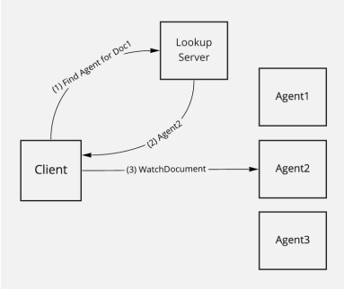
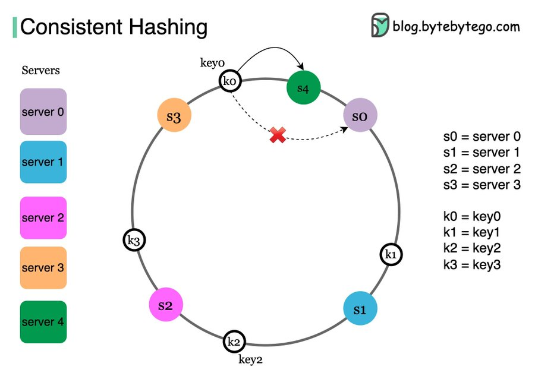
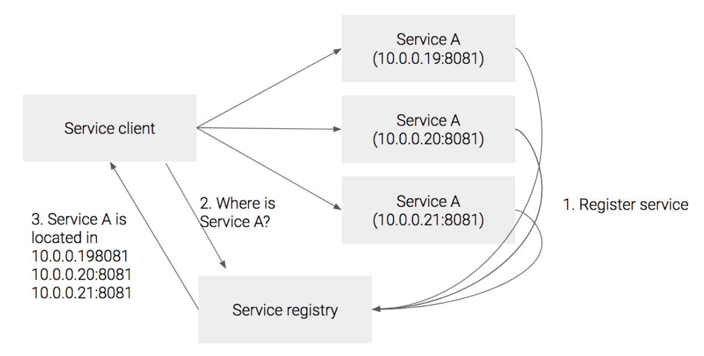
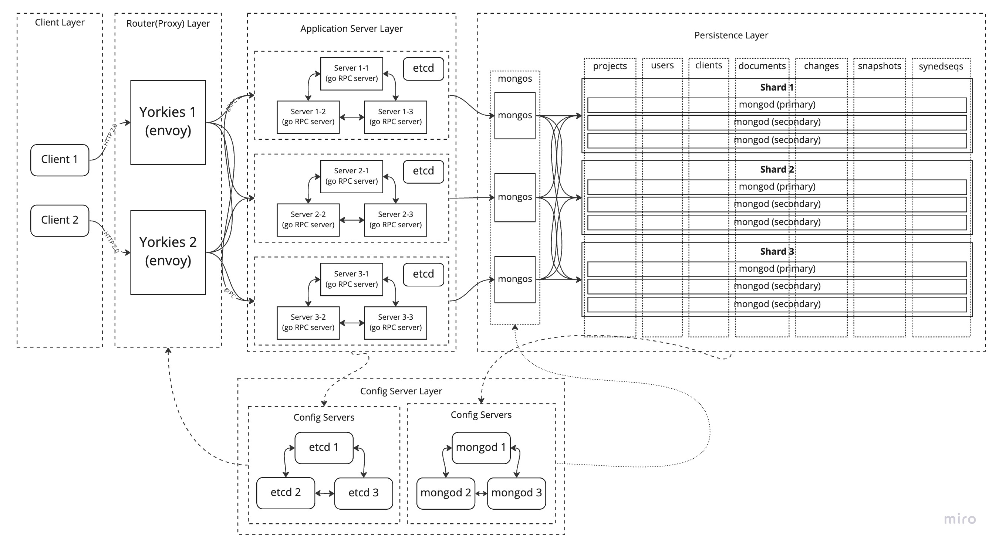
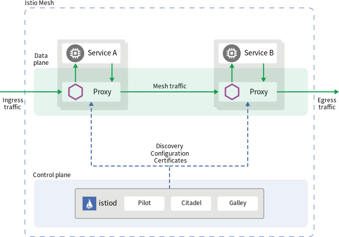

# Introducing Lookup Based Cluster Mode to Yorkie Servers

> Latest update: 2023.02.22

## Table of Contents

- [Introduction to Lookup Based Cluster Mode](#introduction-to-lookup-based-cluster-mode)
- [LookUp Based Cluster Mode Design](#lookup-based-cluster-mode-design)
  - [1. Workload Unit & Server Mapping Strategy & Hash Function](#1-workload-unit---server-mapping-strategy---hash-function)
  - [2. API Compatiability & LookUp Strategy](#2-api-compatiability---lookup-strategy)
  - [3. Server Addition/Removal Strategy](#3-server-addition-removal-strategy)
  - [System Design & Architecture](#system-design---architecture)
- [LookUp Based Cluster Mode Implementation](#lookup-based-cluster-mode-implementation)
  - [Tasks Needed for Lookup Cluster Mode Implementation](#tasks-needed-for-lookup-cluster-mode-implementation)
  - [Lookup Cluster Mode Implementation for PoC](#lookup-cluster-mode-implementation-for-poc)
  - [Yorkie Cluster PoC/Prototype Repository](#yorkie-cluster-poc-prototype-repository)
  - [Actual Infrastuctural Implementation](#actual-infrastuctural-implementation)

## Introduction to Lookup Based Cluster Mode

In production environment, server clusters are necessary to handle large amount of workloads with ensuring high availability, reliability, and scalability.

Current Yorkie server supports [server cluster mode](https://github.com/yorkie-team/yorkie/blob/main/design/cluster-mode.md), which is based on broadcasting, pub/sub, and distributed lock between servers. This architecture can handle certain amount of workloads, but there are limitations.

- **Broadcast and pub/sub overheads**: Because all servers have to communicate to each other with broadcast and pub/sub to share **workload states**, complexity, latency, and performance overheads will grow as more servers are created to handle workloads.
- **Distributed lock overhead**: Because all servers have to compete to acquire lock to use same **workload data**, complexity, latency, and performance overheads will grow as more servers are created to handle workloads.

Because of these limitations, broadcast based cluster mode is not enough for production environment.

The root cause of these limitations is the fact that because **workloads are distributed** throughout all server clusters, additional synchronization throughout all servers is needed.

To solve this, we can **assign each server to process same workloads** to avoid multiple servers accessing to same data, and put **lookup** system to route same workloads to same servers.



(Example of lookup cluster mode in Yorkie)

By introducing lookup based cluster mode, we can reduce/remove additional overheads needed for workload synchronization. And become capable of handling large amount of workloads with ensuring high availability, reliability, and scalability.

Now we discussed about what and why lookup cluster mode is needed, let’s discuss more about how to design lookup cluster mode and how to implement this cluster mode.

## LookUp Based Cluster Mode Design

There are some considerations to be considered to design lookup based cluster mode.

### 1. Workload Unit & Server Mapping Strategy & Hash Function

> **More details will be updated as we discuss.**

Firstly, to assign each server to process same workloads, we need to define what data type is **workload unit** in Yorkie, and then determine **mapping strategy** to evenly distribute workload unit.

Because `document` is the basic unit of collaborative editing, we can define `document` as workload unit in Yorkie. We can confirm that `document` is workload unit because server cluster had to communicate each other to share and sync `document`’s states and data.

This means that if we assign each server to process same `documents`, we no longer need to share and sync states and data between server cluster.

But what about `project` as a unit of workload unit? We can use project is workload unit because `document` is subset of `project`.

But there is problem when we think of this scenario: when user A is in project A, and user A wants to attach to project B’s document, servers need to communicate to share document’s state and data.

Now we have choose workload unit as document, let’s determine mapping strategy to evenly distribute workload `document`.

Choosing mapping strategy for lookup system is crucial, because this will determine performance, efficiency, and scalability of cluster. A cluster with the best possible hardware and infrastructure can be bottlenecked by the choice of key.

There are many mapping strategy, but commonly used algorithm for mapping based on request’s metadata(`document`) is [consistent hashing](https://en.wikipedia.org/wiki/Consistent_hashing).

Consistent hashing is a technique used to map a range of input values (such as request metadata) to a corresponding range of output values (such as server IDs).

The basic idea of consistent hashing is to assign each server to a point on a circular ring or continuum of hash values. When a request arrives, its hash value is computed, and the server responsible for that hash value is determined by finding the next server on the ring, starting from the point where the hash value falls.

This ensures that nearby hash values will be assigned to the same server, providing a degree of consistency in server assignments.



As you can see above, computed hash value is mapped to closest server in clockwise direction, therefore `k0(keyo)` is mapped to `s4(server 4)`. Also, even when `s4` fails, `k0` can be mapped to `s0(server 0)`, this mechanism is helpful when server scale out/scale in, or failover.

Therefore, by setting workload unit as `document` and use consistent hashing for server mapping, we can evenly distribute workload with consistency in server assignments. There can be more specific implementations of ring hash, but I will skip that for now.

Now we have determined mapping strategy as **consistent hashing** with hash function parameter as `document`, let’s discuss about which `document` field we should use for actual hash function parameter, and what hash function to use.

Based on the current implementation of Yorkie, we can use two fields: `Key`, and `ID`

- `Key`: Key is internally name string, and current Yorkie use this field in API.
- `ID`: ID is ObjectID generated by database(ex: mongoDB). This field is not used in current Yorkie API parameter, and only used in internal Yorkie server and DB.

For now, let’s use `Key` for hash function parameter, because Key is currently used in Yorkie API.

Next, let’s choose hash function. There are many hash functions that we can use(ex: MD5, SHA-1, MurmurHash, Jenkins Hash). To accomplish evenly distribute(fine-grained) using `Key(name)`, we need to benchmark all hash functions with `Key(name)` parameter and decide which hash function to use. This will be done in further updates.

### 2. API Compatiability & LookUp Strategy

> **More details will be updated as we discuss.**

Secondly, we need to consider API compatiability with lookup cluster mode. All APIs in Yorkie will successfully compatiable with cluster mode except one API; `watchDocuments()`, which is responsible for mutli-document watching.

If client is watching multi document handled by same server, we can use single server’s `watchDocuments()` API with no problem.

But If client is watching multi document handled by mutliple servers, we need to change API to `watchdocument()`, or introduce different strategy to cluster mode. This will appear again when we discuss about lookup strategy.

Now let’s change our topic and talk about lookup strategy.

In modern cloud environment, servers(containers) are dynamically created. Therefore, new kind of lookup system is introduced to discover dynamically created servers. We call this new lookup system, a **service discovery**.

Considering Yorkie’s production environment, it is better to implement dynamic service discovery then static lookup system.

There are two types of service discovery; client side discovery & server side discovery.



(Client side discovery)

In client side discovery, services register themselves to service registry. After that, client ask service registry where to connect and get response of service location to connect. Now client can connect to service based on the location provided by service registry.

In this scenario, we can use leader/follower node strategy. In leader/follower, leader node is responsible for routing to follower nodes based on service registry’s information. If leader dies, another follower will become leader node based on consensus of nodes(This strategy can be achieved by etcd Raft consensus algorithm).


(Server side discovery)

On the other hand, in server side discovery, there is proxy server(load balancer) in front of services. After services register themselves to service registry, proxy server can get service locations from service registry. Now when client connect to proxy server, proxy server will route to proper service based on service registry’s information.

Now let’s bring API problem and relate to service discovery.

In client side discovery, it is hard to establish stream connection with two services at once if we use `watchdocuments()` API. Therefore, API will be changed to `watchdocument()`. This will cause client’s network code more complex then before.

In server side discovery, we can aggregate multiple stream connection from multiple services and provide client single stream connection. Therefore, we can still use `watchdocuments()` API, which will keep our API compatibility. Also we can keep our client’s network code simple.

For now, it would be better to use **server side discovery(proxy)** then client side discovery to our lookup system design considering the benefits of using proxy, like routing, accomplish API compatiability by stream aggregating, protocol conversion, logging, etc.

Also, using leader/follower strategy(client side discovery) may cause overheads of lock aquire between servers to become leader, and this overhead will increase as number of servers increase(more servers try to aquire lock).

### 3. Server Addition/Removal Strategy

> **More details will be updated as we discuss.**

Lastly, we need to consider the circumstances of server scaling up or server scaling down, or some system failure. In this scenario, servers needs to be added or removed.

To successfully handle these changes, we need server addition/removal strategy.

We need to think carefully because we are using hashed key for routing to servers, so we have to maintain previous hashed key & server mapping the same when there are server addition/removal.

As we discussed earlier, the answer to solve this problem, is again [consistent hashing](https://en.wikipedia.org/wiki/Consistent_hashing). By using ring hash, we can keep our previous hash key mapping the same and successfully add/remove servers. For more information, see 1. Workload Unit & Server Mapping Strategy & Hash Function.

To conclude, we can maintain mapping consistency in server addition/removal by using consistent hashing.

### System Design & Architecture

> **More details will be updated as we discuss.**

Considering all these factors mentioned above, we can now design lookup system architecture.



(Yorkie Lookup Cluster Mode Architecture)

- `Yorkies`: Yorkies is router(proxy) responsible for two tasks.
  - Routing based on request: Yorkies receives requests from client and route to server based on computed request’s hash key and ring hash algorithm.
  - Stream aggregation: Yorkies recieves two watch API streams from different servers and aggregate into one stream.
- `Yorkie service registry`: Service registry is responsible for storing metadata and configuration settings of yorkie servers just like mongoDB’s config servers.
- `Yorkie Service(s)`: Services to process specific workloads. There can be two type of service structure.
  - Single Server: Single Yorkie server will process workload.
  - Cluster Server(Broadcast Mode): Yorkie cluster will process heavy workloads. We can reuse broadcast based yorkie cluster mode to build cluster.
- `mongo`: mongoDB is responsible for sharding and persisting data. There are several components in mongo system.
  - `mongos`: mongos is router responsible for routing data to correct shard based on data’s hash key.
  - `shard`: mongod is actual database responsible for persisting incomding data.
  - `config servers`: Config servers are responsible for storing metadata and configuration settings for the shard. `mongos` will use this information for routing.

From this architecture, we can implement solid lookup based cluster mode capable of handling large amount of workloads with ensuring high availability, reliability, and scalability.

## LookUp Based Cluster Mode Implementation

### Tasks Needed for Lookup Cluster Mode Implementation

Based on the architecture above, This is list of tasks that are needed to implement lookup cluster mode in Yorkie.

1. Tasks for Yorkie services(Servers)
   1. Health check API for health check to proxy
   2. Self-register API for register itself to service registry
   3. DB Schema reconsturction for collection sharding
2. Tasks for mongoDB(Database)
   1. Adminstration mongoDB sharding configuration for sharding
3. Tasks for Yorkies(Proxy/Router)
   1. Configuration for polling server endpoints from service registry
   2. Configuration for ring hash and custom hash function
   3. Configuration for protocol conversion between HTTP and gRPC
   4. Configuration for stream aggregation, multiplexing to aggregate `watchDocuments()` API
4. Tasks for Yorkie Service Registry(Service Registry)
   1. Configuration for service discovery management
   2. API for Yorkie services to register

Task 3 and 4 can be combined, and easily implemented by using Kubernetes and Istio. More specifically, by using Istio’s envoy proxy sidecar, and Istio Pilot for service registry, we can easily implement Task 3 and 4.



(Istio Architecture)

### Lookup Cluster Mode Implementation for PoC

let’s talk about how we actually going to implement lookup based cluster mode.

First, we are going to PoC and prototype our design with `docker-compose`, so implementations below are for PoC/prototype only.

**1. Implementing Yorkies**

There are several open source tools that can be used to implement Yorkies(proxy). `envoy`, `HAProxy`, `nginx`, etc…

First, let’s consider using `envoy`.

`envoy` is open source l7 proxy which can perform Yorkies tasks mentioned above.

- `envoy` uses consistent hashing(ring hash) load balancing algorthim to route to specific service.
- `envoy` also supports stream aggreator filter and stream multiplexing feature to aggreate mutliple streams and sends single stream to client.
- `envoy` also supports gRPC HTTP/2 bridge feature which is needed for web-based gRPC between web clients.

This is an example of `envoy` configuration file that performs ring hash LB based on hash key computed by request’s `x-api-key`

```yaml
static_resources:
  listeners:
    - name: yorkie_listener
      address:
        socket_address: { address: 0.0.0.0, port_value: 8080 }
      filter_chains:
        - filters:
            - name: envoy.filters.network.http_connection_manager
              typed_config:
                "@type": type.googleapis.com/envoy.extensions.filters.network.http_connection_manager.v3.HttpConnectionManager
                stat_prefix: ingress_http
                route_config:
                  name: yorkie_ring_hash_routes
                  virtual_hosts:
                    - name: yorkie_service
                      domains: ["*"]
                      routes:
                        - match: { prefix: "/" }
                          route:
                            cluster: yorkie_service
                            hash_policy:
                              header:
                                header_name: x-api-key
```

**2. Implementing Service Registry**

There are several open source tools that can be used to implement servie registry. `etcd`, `zookeeper`, `euroka`, etc…

First, let’s consider using `etcd`.

`etcd` is open source key-value store that can be used for service discovery. Just like mongoDB’s config server, `etcd` can store metadata for servers.

This is an example of `etcd` configuration file that stores address of services, and provides endpoint for fetching available services.

```json
{
  "endpoints": [
    "http://yorkie1:2379",
    "http://yorkie2:2379",
    "http://yorkie3:2379"
  ],
  "prefix": "/yorkie/services"
}
```

This is an example of `envoy`'s configuration file that performs ring hash routing combined with `etcd`'s service registry.

```yaml
static_resources:
  listeners:
    - name: yorkie_listener
      address:
        socket_address: { address: 0.0.0.0, port_value: 8080 }
      filter_chains:
        - filters:
            - name: envoy.filters.network.http_connection_manager
              typed_config:
                "@type": type.googleapis.com/envoy.extensions.filters.network.http_connection_manager.v3.HttpConnectionManager
                stat_prefix: ingress_http
                route_config:
                  name: yorkie_ring_hash_routes
                  virtual_hosts:
                    - name: yorkie_service
                      domains:
                        - "*"
                      routes:
                        - match:
                            prefix: "/"
                          route:
                            cluster: yorkie_service
                            timeout: 5s
                http_filters:
                  - name: envoy.filters.http.router
  clusters:
    - name: yorkie_service
      connect_timeout: 5s
      type: strict_dns
      lb_policy: ring_hash
      ring_hash_lb_config:
        minimum_ring_size: 3
      load_assignment:
        cluster_name: yorkie_service
        endpoints:
          - lb_endpoints:
              - endpoint:
                  address:
                    socket_address:
                      address: yorkie_service
                      port_value: 8080
```

**3. Creating mongoDB Sharded cluster**

We are using `mongoDB` as Yorkie’s data store. To correspond with Yorkie server clusters large queries, we need to shard mongoDB and build cluster too.

This is an example of `mongoDB` docker-compose file consisting of 2 `mongos`, 3 `shards`, and 1 `config server`.

```yaml
version: "3.7"

services:
  config:
    image: mongo
    container_name: config
    command: mongod --configsvr --replSet configRS --bind_ip_all
    ports:
      - 27019:27019
    networks:
      - mongo
    volumes:
      - config:/data/db

  shard1:
    image: mongo
    container_name: shard1
    command: mongod --shardsvr --replSet shard1RS --bind_ip_all
    ports:
      - 27017:27017
    networks:
      - mongo
    volumes:
      - shard1:/data/db

  shard2:
    image: mongo
    container_name: shard2
    command: mongod --shardsvr --replSet shard2RS --bind_ip_all
    ports:
      - 27018:27017
    networks:
      - mongo
    volumes:
      - shard2:/data/db

  shard3:
    image: mongo
    container_name: shard3
    command: mongod --shardsvr --replSet shard3RS --bind_ip_all
    ports:
      - 27016:27017
    networks:
      - mongo
    volumes:
      - shard3:/data/db

  mongos1:
    image: mongo
    container_name: mongos1
    command: mongos --configdb configRS/config:27019 --bind_ip_all
    ports:
      - 27020:27017
    networks:
      - mongo

  mongos2:
    image: mongo
    container_name: mongos2
    command: mongos --configdb configRS/config:27019 --bind_ip_all
    ports:
      - 27021:27017
    networks:
      - mongo

volumes:
  config:
  shard1:
  shard2:
  shard3:

networks:
  mongo:
```

After creating `mongoDB` containers, we also need to configure `mongod`’s to create sharded cluster and shard collections. Here is some examples of configuration.

```bash
// Enable sharding for database `yorkie-meta`
sh.enableSharding("yorkie-meta")

// Setup shardingKey for yorkie-meta collections
db.adminCommand( { shardCollection: "yorkie-meta.projects", key: { _id: "hashed" } } )
db.adminCommand( { shardCollection: "yorkie-meta.users", key: { username: "hashed" } } )
db.adminCommand( { shardCollection: "yorkie-meta.clients", key: { project_id: "hashed" } } )
db.adminCommand( { shardCollection: "yorkie-meta.documents", key: { project_id: "hashed" } } )
db.adminCommand( { shardCollection: "yorkie-meta.changes", key: { doc_id: "hashed" } } )
db.adminCommand( { shardCollection: "yorkie-meta.snapshots", key: { doc_id: "hashed" } } )
db.adminCommand( { shardCollection: "yorkie-meta.syncedseqs", key: { doc_id: "hashed" } } )
```

### Yorkie Cluster PoC/Prototype Repository

Below is PoC for implementation for `docker-compose`. This repository combines all implementations above and shows simple lookup based cluser mode of Yorkie.

[https://github.com/krapie/yorkie-cluster](https://github.com/krapie/yorkie-cluster)

### Actual Infrastuctural Implementation

> **More details will be updated as we discuss.**

Actual implementation will be on Kubernetes & Istio. As I mentioned above.
