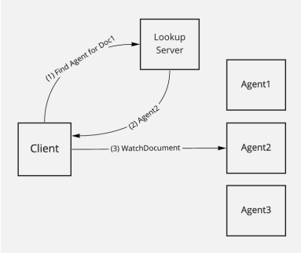
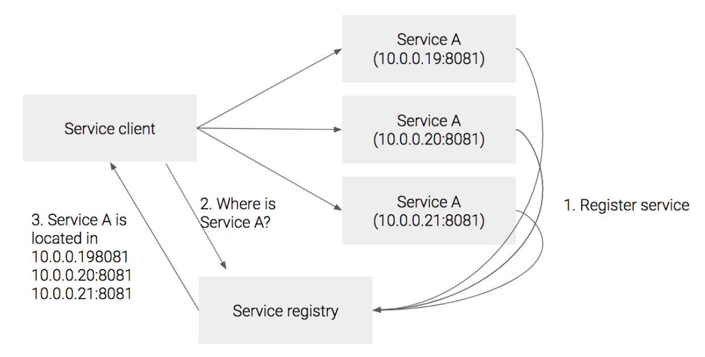
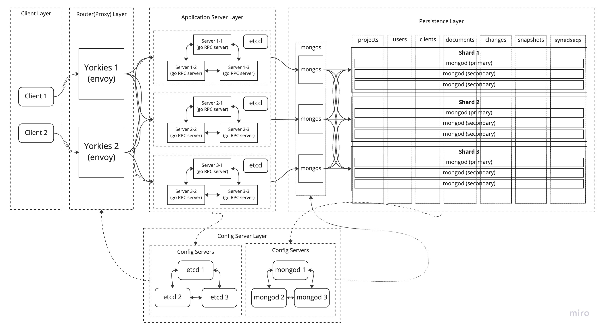

## Introduction to LookUp Based Cluster Mode

In production environment, server clusters are necessary to handle large amount of workloads with ensuring high availability, reliability, and scalability.

Current Yorkie server supports [server cluster mode](https://github.com/yorkie-team/yorkie/blob/main/design/cluster-mode.md), which is based on broadcasting, pub/sub, and distributed lock between servers. This architecture can handle certain amount of workloads, but there are limitations.

- **Broadcast and pub/sub overheads**: Because all servers have to communicate to each other with broadcast and pub/sub, complexity, latency, and performance overheads will grow as more servers are created to handle workloads.
- **Distributed lock overhead**: Because all servers have to compete to aquire lock to use same data, complexity, latency, and performance overheads will grow as more servers are created to handle workloads.

Because of these limitations, broadcast based cluster mode is not enough for production environment.

The root cause of these limitations is the fact that because workloads are distributed throughout all server clusters, additional synchronization throughout all servers is needed.

To solve this, we can assign each server to process same workloads to avoid multiple servers acessing to same data, and put **lookup** system to route same workloads to same servers.



Example of lookup cluster mode in Yorkie

By introducing lookup based cluster mode, we can reduce/remove additional overheads needed for workload synchronization. And become capable of handling large amount of workloads with ensuring high availability, reliability, and scalability.

Now we disccuessed about what and why lookup cluster mode is needed, let’s discuss more about how to design lookup cluster mode and how to implement this cluster mode.

## LookUp Based Cluster Mode Design (WIP)

There are some considerations to be considered to design lookup based cluster mode.

### 1. API Compatiability & LookUp Strategy

> **More details will be updated as we discuss.**
> 

First, We need to consider API compatiability with lookup cluster mode. All APIs in Yorkie will successfully compatiable with cluster mode except one API; `watchDocuments()`, which is responsible for mutli-document watching.

If client is watching multi document handled by same server, we can use single server’s `watchDocuments()` API with no problem.

But If client is watching multi document handled by mutliple servers, we need to change API to `watchdocument()`, or introduce different strategy  to cluster mode. This will appear again when we discuss about lookup strategy.

Now let’s change our topic and talk about lookup strategy.

In modern cloud environment, servers(containers) are dynamically created. Therefore, new kind of lookup system is introduced to discover dynamically created servers. We call this new lookup system, a **service discovery**.

Considering Yorkie’s production environment, it is better to implement dynamic service discovery then static lookup system.

There are two types of service discovery; client side discovery & server side discovery.



client side discovery

In client side discovery, services register themselves to service registry. After that, client ask service registry(server can be service registry too, and leader node will be responsible for this) where to connect and get response of service location to connect. Now client can connect to service based on the location provided by service registry.


server side discovery

On the other hand, in server side discovery, there is proxy server(load balancer) in front of services, and this server gets service locations from service registry. Now client can connect to proxy server, and proxy server will route to proper service.

Now let’s bring API problem and relate to service discovery.

In client side discovery, it is hard to establish stream connection with two services at once if we use `watchdocuments()` API. Therefore, API will be changed to `watchdocument()`. This will cause client’s network code more complex then before.

In server side discovery, we can aggregate multiple stream connection from multiple services and provide client single stream connection. Therefore, we can still use `watchdocuments()` API, which will keep our API compatibility. Also we can keep our client’s network code simple.

To conclude, it is better to use server side discovery then client side discovery to our lookup system design based on API compatiability and other conditions.

### 2. Document Key & Server Mapping Strategy

> **More details will be updated as we discuss.**
> 

Choosing mapping strategy(key) for lookup system is crucial, because this will determine performance, efficiency, and scalability of cluster. A cluster with the best possible hardware and infrastructure can be bottlenecked by the choice of key.

There are two major key strategy; hashed key & ranged key.

Hashed key offers following advantages over ranged key:

1. Randomized distribution: Hashed keys are distributed randomly across the nodes in a distributed system, which can help to evenly distribute the workload and prevent hotspots. In contrast, a ranged key may result in uneven distribution of data, with some nodes having more data than others.
2. Security: Hashed keys provide better security for sensitive data, as they do not reveal any information about the order or distribution of the data. In contrast, a ranged key may provide clues about the order or distribution of the data.
3. Flexibility: Hashed keys provide more flexibility in terms of the type of queries that can be performed, as any key value can be used in a hash lookup. In contrast, a ranged key is limited to a specific range of values.

On the other hand, ranged key offers advantages that hashed key doesn’t have:

1. Ordered queries: If the queries frequently require ordering based on the key values, a ranged key can be more efficient than a hashed key.
2. Range queries: If the queries require retrieving a range of values based on the key values, a ranged key can be more efficient than a hashed key.

Considering Yorkie’s workload, it is important to distribute workload evenly. Therefore, it is better to choose hashed key over ranged key. Also range queries are not needed in Yorkie’s workload.

To conclude, it is better to use hashed key then ranged key considering Yorkie’s workloads.

### 3. Server Addition/Removal Strategy

> **More details will be updated as we discuss.**
> 

We also need to consider the circumstances of server scaling up or server scaling down, or some system failure. In this scenario, servers needs to be added or removed.

To successfully handle these changes, we need server addition/removal strategy.

We need to think carefully because we are using hashed key for routing to servers, so we have to maintain previous hashed key & server mapping the same when there are server addition/removal.

The answer to solve this problem, is [consistent hashing](https://en.wikipedia.org/wiki/Consistent_hashing)(ring hash). By using ring hash, we can keep our previous hash key mapping the same and successfully add/remove servers.

To conclude, we need to use consistent hashing to maintain mapping consistency in server addition/removal.

### System Design & Architecture

> **More details will be updated as we discuss.**
> 

Considering all these factors mentioned above, we can now design lookup system architecture.



Yorkie LookUp Cluster Mode Architecture (WIP)

- `Yorkies`: Yorkies is router(proxy) responsible for two tasks.
    - Routing based on request: Yorkies receives requests from client and route to server based on computed request’s hash key and ring hash algorithm.
    - Stream aggregation: Yorkies recieves two watch API streams from different servers and aggregate into one stream.
- `Yorkie service registry`: Service registry is responsible for storing metadata and configuration settings of yorkie servers just like mongoDB’s config servers.
- `Yorkie Service(s)`: Services to process specific workloads. There can be two type of service structure.
    - Single service: Single Yorkie server will process workload.
    - Cluster services: Yorkie cluster will process heavy workloads. We can reuse broadcast based yorkie cluster mode to build cluster.
- `mongo`: mongoDB is responsible for sharding and persisting data. There are several components in mongo system.
    - `mongos`: mongos is router responsible for routing data to correct shard based on data’s hash key.
    - `shard`: mongod is actual database responsible for persisting incomding data.
    - `config servers`: Config servers are responsible for storing metadata and configuration settings for the shard. `mongos` will use this information for routing.

From this architecture, we can implement solid lookup based cluster mode capable of handling large amount of workloads with ensuring high availability, reliability, and scalability.

## LookUp Based Cluster Mode Implementation (WIP)

Based on the architecture above, let’s talk about how we actually going to implement lookup based cluster mode.

First, we are going to PoC and prototype our design, so implementations below are for PoC/prototype only.

### 1. Implementing Yorkies

> **More details will be updated as we discuss.**
> 

There are several open source tools that can be used to implement Yorkies(proxy). `envoy`, `HAProxy`, `nginx`, etc…

First, let’s consider using `envoy`.

`envoy` is open source l7 proxy which can perform Yorkies tasks mentioned above.

- `envoy` uses consistent hashing(ring hash) load balancing algorthim to route to specific service.
- `envoy` also supports stream aggreator filter and stream multiplexing feature to aggreate mutliple streams and sends single stream to client.
- `envoy` also supports gRPC HTTP/2 bridge feature which is needed for web-based gRPC between web clients.

This is an example of  `envoy` configuration file that performs ring hash LB based on hash key computed by request’s `x-api-key`

```yaml
static_resources:
  listeners:
    - name: yorkie_listener
      address:
        socket_address: { address: 0.0.0.0, port_value: 8080 }
      filter_chains:
        - filters:
            - name: envoy.filters.network.http_connection_manager
              typed_config:
                "@type": type.googleapis.com/envoy.extensions.filters.network.http_connection_manager.v3.HttpConnectionManager
                stat_prefix: ingress_http
                route_config:
                  name: yorkie_ring_hash_routes
                  virtual_hosts:
                    - name: yorkie_service
                      domains: ["*"]
                      routes:
                        - match: { prefix: "/" }
                          route:
                            cluster: yorkie_service
                            hash_policy:
                              header:
                                header_name: x-api-key
```

### 2. Implementing Service Registry

> **More details will be updated as we discuss.**
> 

There are several open source tools that can be used to implement servie registry. `etcd`, `zookeeper`, `euroka`, etc…

First, let’s consider using `etcd`.

`etcd` is open source key-value store that can be used for service discovery. Just like mongoDB’s config server, `etcd` can store metadata for servers.

This is an example of  `etcd` configuration file that stores address of services, and provides endpoint for fetching available services.

```json
{
    "endpoints": ["http://yorkie1:2379", "http://yorkie2:2379", "http://yorkie3:2379"],
    "prefix": "/yorkie/services"
}
```

This is an example of `envoy`'s configuration file that performs ring hash routing combined with `etcd`'s service registry.

```yaml
static_resources:
  listeners:
    - name: yorkie_listener
      address:
        socket_address: { address: 0.0.0.0, port_value: 8080 }
      filter_chains:
        - filters:
            - name: envoy.filters.network.http_connection_manager
              typed_config:
                "@type": type.googleapis.com/envoy.extensions.filters.network.http_connection_manager.v3.HttpConnectionManager
                stat_prefix: ingress_http
                route_config:
                  name: yorkie_ring_hash_routes
                  virtual_hosts:
                    - name: yorkie_service
                      domains:
                        - "*"
                      routes:
                        - match:
                            prefix: "/"
                          route:
                            cluster: yorkie_service
                            timeout: 5s
                http_filters:
                  - name: envoy.filters.http.router
  clusters:
    - name: yorkie_service
      connect_timeout: 5s
      type: strict_dns
      lb_policy: ring_hash
      ring_hash_lb_config:
        minimum_ring_size: 3
      load_assignment:
        cluster_name: yorkie_service
        endpoints:
          - lb_endpoints:
              - endpoint:
                  address:
                    socket_address:
                      address: yorkie_service
                      port_value: 8080
```

### 3. Creating mongoDB Sharded cluster

> **More details will be updated as we discuss.**
> 

We are using `mongoDB` as Yorkie’s data store. To correspond with Yorkie server clusters large queries, we need to shard mongoDB and build cluster too.

This is an example of `mongoDB` docker-compose file consisting of 2 `mongos`, 3 `shards`, and 1 `config server`.

```yaml
version: "3.7"

services:
  config:
    image: mongo
    container_name: config
    command: mongod --configsvr --replSet configRS --bind_ip_all
    ports:
      - 27019:27019
    networks:
      - mongo
    volumes:
      - config:/data/db

  shard1:
    image: mongo
    container_name: shard1
    command: mongod --shardsvr --replSet shard1RS --bind_ip_all
    ports:
      - 27017:27017
    networks:
      - mongo
    volumes:
      - shard1:/data/db

  shard2:
    image: mongo
    container_name: shard2
    command: mongod --shardsvr --replSet shard2RS --bind_ip_all
    ports:
      - 27018:27017
    networks:
      - mongo
    volumes:
      - shard2:/data/db

  shard3:
    image: mongo
    container_name: shard3
    command: mongod --shardsvr --replSet shard3RS --bind_ip_all
    ports:
      - 27016:27017
    networks:
      - mongo
    volumes:
      - shard3:/data/db

  mongos1:
    image: mongo
    container_name: mongos1
    command: mongos --configdb configRS/config:27019 --bind_ip_all
    ports:
      - 27020:27017
    networks:
      - mongo

  mongos2:
    image: mongo
    container_name: mongos2
    command: mongos --configdb configRS/config:27019 --bind_ip_all
    ports:
      - 27021:27017
    networks:
      - mongo

volumes:
  config:
  shard1:
  shard2:
  shard3:

networks:
  mongo:
```

After creating `mongoDB` containers, we also need to configure `mongod`’s to create sharded cluster and shard collections. Here is some examples of configuration.

```bash
// Enable sharding for database `yorkie-meta`
sh.enableSharding("yorkie-meta")

// Setup shardingKey for yorkie-meta collections
db.adminCommand( { shardCollection: "yorkie-meta.projects", key: { _id: "hashed" } } )
db.adminCommand( { shardCollection: "yorkie-meta.users", key: { username: "hashed" } } )
db.adminCommand( { shardCollection: "yorkie-meta.clients", key: { project_id: "hashed" } } )
db.adminCommand( { shardCollection: "yorkie-meta.documents", key: { project_id: "hashed" } } )
db.adminCommand( { shardCollection: "yorkie-meta.changes", key: { doc_id: "hashed" } } )
db.adminCommand( { shardCollection: "yorkie-meta.snapshots", key: { doc_id: "hashed" } } )
db.adminCommand( { shardCollection: "yorkie-meta.syncedseqs", key: { doc_id: "hashed" } } )
```

### PoC/Prototype

Below is PoC for implementation for docker-compose. This repository combines all implementations above and shows simple lookup based cluser mode of Yorkie.

[https://github.com/krapie/yorkie-cluster](https://github.com/krapie/yorkie-cluster)

### Actual Infrastuctural Implementation

> **More details will be updated as we discuss.**
> 

Actual implementation will be on Kubernetes & Istio.