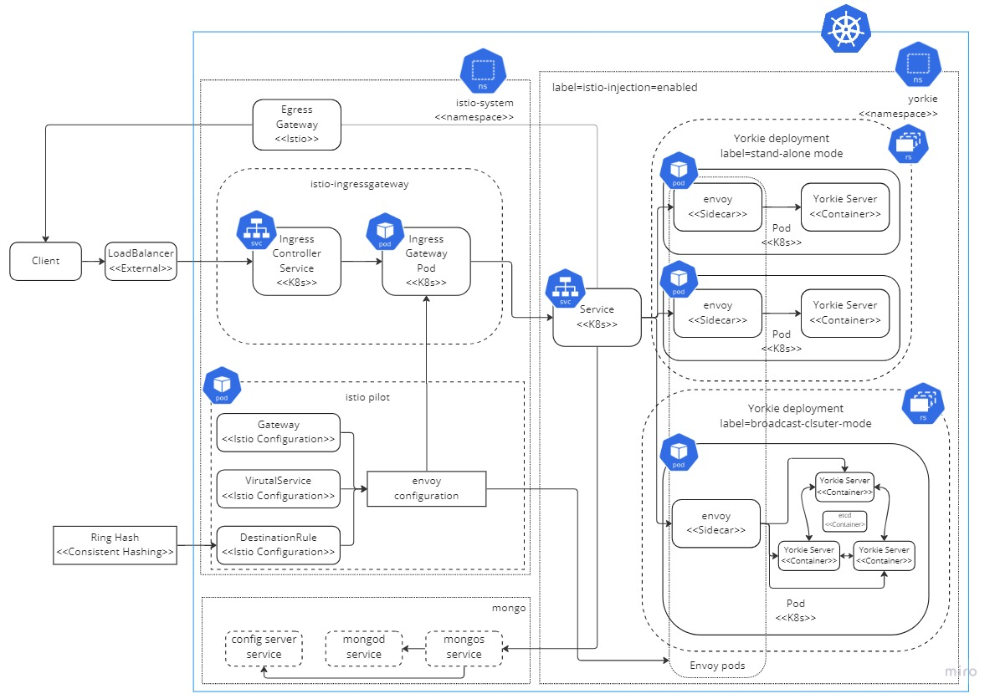

# Yorkie LookUp Cluster K8s & Istio PoC

## Getting Started

```bash
# 1. clone repository
git clone https://github.com/krapie/yorkie-cluster.git

# 2. change to project directory
cd yorkie-cluster

# 3. start minikube cluster
minikube start

# 4. Install Istioctl and set PATH
curl -L https://istio.io/downloadIstio | sh -

cd istio-1.17.1

export PATH=$PWD/bin:$PATH

# 5. Install Istio with demo profile
istioctl install --set profile=demo -y

# 6. create yorkie namespace and switch context (optional)
kubectl create namespace yorkie
# kubectl config set-context --current --namespace yorkie

# 7. Set auto envoy sidecar injetion in namespace
kubectl label namespace yorkie istio-injection=enabled

# 5. deploy all minikube manifests in minikube cluster
kubectl apply -f minikube/lookup-cluster-mode --recursive

# 6. start minikube tunneling for local connection
minikube tunnel

# 7. test yorkie api!
const client = new yorkie.Client('http://localhost');
```

## Architecture & Project Structure



Project Structure consists of deployment, networking, and service configurations.
This follows standard K8s & Istio configuration structure pattern.

- `deployment`: Set of .yaml configuration files for k8s deployment.
  - `mongo-statefulset.yaml`: configuration for single mongoDB. mongo cluster sharding will soon be implemented.
  - `yorkie-deplyment.yaml`: configuration file for stand-alone yorkie server. yorkie broadcast cluter mode deployment will soon be implemented.
- `networking`: Set of .yaml configuration files for high-level networking for istio.
  - `destination-rule-yorkie.yaml`: configuration for load balancing traffic to specific yorkie service. Load balancing is done by ring hash algorithm, using `x-api-key` request header as hash parameter.
  - `virtual-service-yorkie.yaml`: configuration for routing traffic to yorkie service or a admin service based on url.
  - `yorkie-gateway.yaml`: configuration for istio ingress gateway.
- `service`: Set of .yaml configuration files for k8s service.
  - `mongo-service.yaml`: configuration for connecting mongo pod to k8s network.
  - `yorkie-service.yaml`: configuration for connecting yorkie server pods to k8s network.

See each .yaml files for more details.

## Ring Hash Strategy

Currently, ring hash based lookup is performed by request's `x-api-key` header.
This setting is just to demonstrate concept of lookup cluster mode.

Therefore, you need to put API Key in Yorkie Client to see proper routing.
